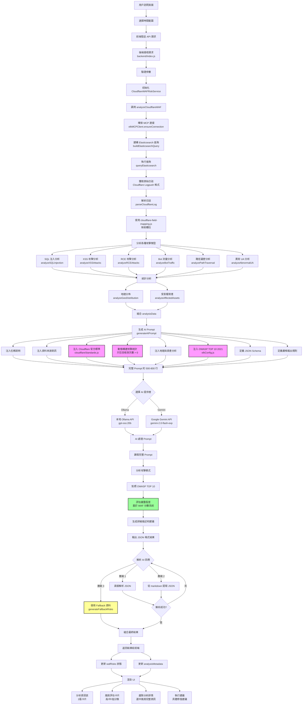
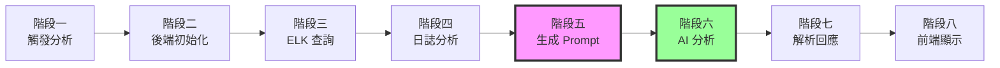

# Across-AI 專案 - AI 分析完整流程文檔

> 📄 **文件版本**: 1.0  
> 📅 **建立日期**: 2025-11-14  
> 🎯 **用途**: AI 觸發到結束提供分析結果的完整流程說明

---

## 📑 目錄

1. [流程概述](#流程概述)
2. [階段一: 觸發 AI 分析](#階段一-觸發-ai-分析)
3. [階段二: 後端接收與初始化](#階段二-後端接收與初始化)
4. [階段三: 從 ELK 獲取資料](#階段三-從-elk-獲取資料)
5. [階段四: 解析與分析日誌資料](#階段四-解析與分析日誌資料)
6. [階段五: 參考 Cloudflare 官方文件生成 AI Prompt](#階段五-參考-cloudflare-官方文件生成-ai-prompt)
7. [階段六: 調用 AI 模型進行分析](#階段六-調用-ai-模型進行分析)
8. [階段七: 解析 AI 回應](#階段七-解析-ai-回應)
9. [階段八: 返回結果給前端](#階段八-返回結果給前端)
10. [關鍵資料來源整理](#關鍵資料來源整理)
11. [核心檔案清單](#核心檔案清單)
12. [Mermaid 流程圖](#mermaid-流程圖)

---

## 流程概述

本專案的 AI 分析系統透過以下核心技術實現自動化威脅分析：

- **數據來源**: Elasticsearch (ELK Stack) - Cloudflare WAF 日誌
- **查詢協議**: MCP (Model Context Protocol)
- **AI 模型**: Google Gemini 2.0 Flash / Ollama (gpt-oss:20b)
- **參考標準**: 
  - Cloudflare 官方 WAF 分數系統
  - OWASP TOP 10 2021
  - Cloudflare 官方文件

**關鍵特色**：AI 不需要程式去引用讀取文件，所有官方標準和分類都透過 Prompt 動態注入，讓 AI 在訓練階段就能學習到完整的分析流程。

---

## 階段一: 觸發 AI 分析

### 1.1 用戶操作

```yaml
觸發方式:
  - 訪問頁面: http://localhost:3000/ai-analysis/cloudflare
  - 選擇時間範圍: 1h / 6h / 12h / 24h / 7d / 30d
  - 點擊「開始分析」或自動載入 (useEffect)
```

### 1.2 前端發送請求

**API 端點**:
```
POST /api/analyze-waf-risks-cloudflare
```

**請求參數**:
```json
{
  "aiProvider": "gemini" | "ollama",
  "apiKey": "your-gemini-api-key",
  "model": "gemini-2.0-flash-exp" | "gpt-oss:20b",
  "timeRange": "24h"
}
```

**相關檔案**:
- 前端頁面: `frontend/app/ai-analysis/cloudflare/page.tsx`
- 狀態管理: `frontend/app/dashboard/waf-data-context.tsx`

---

## 階段二: 後端接收與初始化

### 2.1 後端 API 接收

**檔案位置**: `backend/index.js` (第 1530-1543 行)

```javascript
app.post('/api/analyze-waf-risks-cloudflare', async (req, res) => {
  const { apiKey, model = 'gemini-2.0-flash-exp', timeRange = '24h', aiProvider = 'gemini' } = req.body;
  
  // 驗證參數
  if (aiProvider !== 'ollama' && !apiKey) {
    return res.status(400).json({ error: '請先設定 Gemini API Key 或使用 Ollama' });
  }
  
  // ... 後續處理
});
```

### 2.2 初始化服務

```javascript
// Step 1: 建立 CloudflareWAFRiskService 實例
const CloudflareWAFRiskService = require('./services/cloudflareWAFRiskService');
const wafService = new CloudflareWAFRiskService();
```

**服務檔案**: `backend/services/cloudflareWAFRiskService.js`

---

## 階段三: 從 ELK 獲取資料

### 3.1 查詢 ELK 日誌

**方法調用**:
```javascript
// Step 2: 透過 ELK MCP 分析 Cloudflare WAF 資料
const analysisData = await wafService.analyzeCloudflareWAF(timeRange);
```

**檔案位置**: `backend/services/cloudflareWAFRiskService.js` (第 28-103 行)

### 3.2 MCP 連接流程

**服務檔案**: `backend/services/elkMCPClient.js`

```yaml
步驟:
  1. 確保 MCP 連接
     - elkMCPClient.ensureConnection()
     - 支援協議: HTTP / stdio / proxy
     - 自動重試機制 (最多 3 次)
  
  2. 建構 Elasticsearch 查詢
     - elkMCPClient.buildElasticsearchQuery(timeRange)
     - 索引: across-cf-logpush-*
     - 時間過濾: @timestamp (gte: now-24h, lte: now)
     - 排序: 按時間降序
     - 數量限制: 1000 筆
  
  3. 執行查詢
     - elkMCPClient.queryElasticsearch(timeRange)
     - 透過 MCP 協議調用 Elasticsearch
     - 返回格式: { total, hits: [{id, source, timestamp}] }
  
  4. 獲取原始日誌
     - 日誌格式: Cloudflare Logpush 格式
     - 包含欄位: ClientIP, WAFAttackScore, SecurityAction, etc.
```

**配置檔案**:
- ELK 配置: `backend/config/elkConfig.js`
- 欄位映射: `cloudflare-field-mapping.js`

### 3.3 Elasticsearch 查詢範例

```json
{
  "query": {
    "range": {
      "@timestamp": {
        "gte": "2025-11-13T00:00:00Z",
        "lte": "2025-11-14T00:00:00Z"
      }
    }
  },
  "sort": [
    {
      "@timestamp": {
        "order": "desc"
      }
    }
  ],
  "size": 1000
}
```

---

## 階段四: 解析與分析日誌資料

### 4.1 解析 Cloudflare 日誌

**方法**: `parseCloudflareLog(rawLog)`

**使用欄位映射**:
```javascript
// cloudflare-field-mapping.js
{
  rayId: rawLog["RayID"],
  clientIP: rawLog["ClientIP"],
  clientCountry: rawLog["ClientCountry"],
  requestURI: rawLog["ClientRequestURI"],
  userAgent: rawLog["ClientRequestUserAgent"],
  wafAttackScore: rawLog["WAFAttackScore"],
  wafSQLiScore: rawLog["WAFSQLiAttackScore"],
  wafXSSScore: rawLog["WAFXSSAttackScore"],
  wafRCEScore: rawLog["WAFRCEAttackScore"],
  securityAction: rawLog["SecurityAction"],
  edgeHost: rawLog["ClientRequestHost"],
  timestamp: rawLog["EdgeStartTimestamp"]
}
```

### 4.2 分析各種攻擊類型

基於 **Cloudflare 官方標準** (`backend/config/cloudflareStandards.js`)

#### 4.2.1 SQL 注入分析

**方法**: `analyzeSQLInjection(logEntries)`

**檢測條件**:
```yaml
篩選規則:
  - WAFSQLiScore: 1-50 分 (有效攻擊分數)
  - 排除內部端點: /cdn-cgi/*
  - 排除未評分: 0 或 100 分
  - 或觸發 SQL 相關規則

分類標準:
  - 高風險 (Attack): WAF 分數 1-20
  - 中風險 (Likely Attack): WAF 分數 21-50

輸出資料:
  - count: 檢測次數
  - highRisk: 高風險次數
  - topIPs: Top 10 來源 IP
  - topTargets: Top 10 攻擊目標
  - topCountries: Top 5 來源國家
  - affectedAssets: 受影響資產數
  - avgScore: 平均 WAF 分數
```

**程式碼片段**:
```javascript
analyzeSQLInjection(logEntries) {
  const sqliLogs = logEntries.filter(log => 
    !isCloudflareInternalEndpoint(log.requestURI) &&
    (
      (isValidWAFScore(log.wafSQLiScore) && log.wafSQLiScore <= 50) ||
      (log.securityRule && log.securityRule.toLowerCase().includes('sql'))
    )
  );
  
  const highRiskLogs = sqliLogs.filter(log => 
    isValidWAFScore(log.wafSQLiScore) && 
    log.wafSQLiScore >= 1 && 
    log.wafSQLiScore <= 20
  );
  
  return {
    count: sqliLogs.length,
    highRisk: highRiskLogs.length,
    topIPs: this.getTopN(sqliLogs, 'clientIP', 10),
    topTargets: this.getTopN(sqliLogs, 'requestURI', 10),
    topCountries: this.getTopN(sqliLogs, 'clientCountry', 5),
    affectedAssets: new Set(sqliLogs.map(log => log.edgeHost)).size,
    avgScore: calculateValidAvgScore(sqliLogs, 'wafSQLiScore')
  };
}
```

#### 4.2.2 XSS 攻擊分析

**方法**: `analyzeXSSAttacks(logEntries)`

**檢測條件**:
```yaml
篩選規則:
  - WAFXSSScore: 1-50 分
  - 排除內部端點: /cdn-cgi/*
  - 排除未評分: 0 或 100 分
  - 或觸發 XSS 相關規則
  - 或 URI 包含: <script>, javascript:

輸出結構: 同 SQL 注入
```

#### 4.2.3 RCE 攻擊分析

**方法**: `analyzeRCEAttacks(logEntries)`

**檢測條件**:
```yaml
篩選規則:
  - WAFRCEScore: 1-50 分
  - 排除內部端點: /cdn-cgi/*
  - 排除未評分: 0 或 100 分
  - 或觸發 RCE/remote code 相關規則

輸出結構: 同 SQL 注入
```

#### 4.2.4 惡意機器人分析

**方法**: `analyzeBotTraffic(logEntries)`

**檢測條件**:
```yaml
User-Agent 特徵:
  - 包含: bot, crawler, spider, python, curl, wget
  
輸出資料:
  - count: 檢測次數
  - topIPs: Top 10 來源 IP
  - topCountries: Top 5 來源國家
  - topASNs: Top 5 ASN
  - affectedAssets: 受影響資產數
```

#### 4.2.5 路徑遍歷分析

**方法**: `analyzePathTraversal(logEntries)`

**檢測條件**:
```yaml
URI 特徵:
  - 包含: ../, ..\, %2e%2e, traversal

敏感檔案檢測:
  - .env, config, .git, wp-config, web.config
  - admin, .htaccess, .htpasswd
  - id_rsa, authorized_keys, .aws, .ssh
  - database.yml, settings.py

輸出資料:
  - count: 檢測次數
  - topIPs: Top 10 來源 IP
  - sensitiveFiles: 敏感檔案列表 (最多 15 個)
  - affectedAssets: 受影響資產數
```

#### 4.2.6 異常 User-Agent 分析

**方法**: `analyzeAbnormalUA(logEntries)`

**檢測條件**:
```yaml
異常特徵:
  - UA 長度 = 0 (空 UA)
  - UA 長度 < 10 (異常短)
  - UA 長度 > 500 (異常長)
  - 包含掃描工具: sqlmap, nmap, nikto, masscan, zap, burp, metasploit

輸出資料:
  - count: 檢測次數
  - topIPs: Top 10 來源 IP
  - examples: UA 範例 (最多 5 個)
  - affectedAssets: 受影響資產數
```

### 4.3 統計分析

#### 4.3.1 地理分佈分析

**方法**: `analyzeGeoDistribution(logEntries)`

```yaml
統計項目:
  - topCountries: Top 10 攻擊來源國家
  - topIPs: Top 20 攻擊來源 IP
  - topASNs: Top 10 ASN
```

#### 4.3.2 受影響資產分析

**方法**: `analyzeAffectedAssets(logEntries)`

```yaml
統計項目:
  - totalAssets: 受攻擊的唯一域名總數
  - topAssets: Top 20 被攻擊資產
```

### 4.4 組合分析結果

**輸出格式**:
```javascript
analysisData = {
  // 攻擊類型統計
  sqlInjection: {
    count: 150,
    highRisk: 45,
    topIPs: [{item: '1.2.3.4', count: 30}, ...],
    topTargets: [{item: '/api/login', count: 25}, ...],
    topCountries: [{item: 'CN', count: 80}, ...],
    affectedAssets: 5,
    avgScore: 15.3
  },
  xssAttacks: { /* 同上結構 */ },
  rceAttacks: { /* 同上結構 */ },
  botTraffic: { /* 類似結構 */ },
  pathTraversal: { /* 類似結構 */ },
  abnormalUA: { /* 類似結構 */ },
  
  // 地理和資產分析
  geoAnalysis: {
    topCountries: [{item: 'CN', count: 200}, ...],
    topIPs: [{item: '1.2.3.4', count: 50}, ...],
    topASNs: [{item: 'AS4134', count: 100}, ...]
  },
  assetAnalysis: {
    totalAssets: 8,
    topAssets: [{item: 'api.example.com', count: 300}, ...]
  },
  
  // 總體統計
  totalEvents: 1234,
  timeRange: {
    start: '2025-11-13T00:00:00Z',
    end: '2025-11-14T00:00:00Z'
  }
}
```

---

## 階段五: 參考 Cloudflare 官方文件生成 AI Prompt

### 5.1 Prompt 生成方法

**方法**: `CloudflareWAFRiskService.generateAIPrompt(analysisData)`

**檔案位置**: `backend/services/cloudflareWAFRiskService.js` (第 324-556 行)

### 5.2 Prompt 結構

#### 5.2.1 任務說明

```markdown
你是一位資深的網路安全分析專家，專精於 Cloudflare WAF 日誌分析和威脅識別。

### 【任務說明】

請根據以下 Cloudflare WAF 日誌數據，**自動識別並分類所有攻擊類型**，生成完整的風險評估報告。

**重要：請不要使用預設的攻擊類型清單。所有攻擊類型都應該從日誌數據中自動識別。**
```

#### 5.2.2 資料來源資訊

```markdown
### 【資料來源】

- **索引名稱**: across-cf-logpush-*
- **時間範圍**: 2025-11-13T00:00:00Z ~ 2025-11-14T00:00:00Z
- **總日誌數**: 1,234 筆
- **分析時間**: 2025-11-14T10:30:00Z
```

#### 5.2.3 注入 Cloudflare 官方標準 ⭐

**來源**: `backend/config/cloudflareStandards.js`

```markdown
### 【Cloudflare WAF 攻擊分數系統（官方標準）】

**分數範圍**: 1-99（分數越低越危險）

- **1-20**: Attack（攻擊） - 幾乎確定是惡意攻擊
- **21-50**: Likely Attack（可能攻擊） - 可能是攻擊，但此範圍容易誤報
- **51-80**: Likely Clean（可能正常） - 可能是正常流量
- **81-99**: Clean（正常） - 很可能是正常流量
- **100 或 0**: Unscored（未評分） - WAF 沒有評分此請求

**重要規則**:
- 分數 0 或 100 = 未評分，**不代表攻擊**，已自動排除
- 只有分數 1-99 才是有效的評分結果
- 所有內部 Cloudflare 端點（`/cdn-cgi/*`）已自動過濾
```

#### 5.2.4 動態構建攻擊統計 ⭐ (核心邏輯)

**關鍵特色**: 只包含檢測次數 > 0 的攻擊類型

```javascript
// 動態構建攻擊統計
const attackSections = [];

if (sqlInjection.count > 0) {
  attackSections.push({
    type: 'SQL 注入攻擊',
    data: sqlInjection,
    description: 'WAFSQLiAttackScore <= 50 或 SecurityRule 包含 "sql"'
  });
}

if (xssAttacks.count > 0) {
  attackSections.push({
    type: 'XSS 跨站腳本攻擊',
    data: xssAttacks,
    description: 'WAFXSSAttackScore <= 50 或 SecurityRule 包含 "xss"'
  });
}

// ... 其他攻擊類型
```

**Prompt 輸出範例**:
```markdown
### 【攻擊統計（基於真實 Cloudflare 日誌）】

1. **SQL 注入攻擊**
   - 檢測方式: WAFSQLiAttackScore <= 50 或 SecurityRule 包含 "sql"
   - 檢測次數: 150
   - 高風險 (WAF分數 1-20): 45
   - 平均 WAF 分數: 15.3
   - 受影響資產: 5
   - Top 5 來源IP: 1.2.3.4 (30次), 5.6.7.8 (25次), ...
   - Top 5 來源國家: CN (80次), US (30次), ...
   - Top 5 攻擊目標: /api/login (25次), /admin/config (20次), ...

2. **XSS 跨站腳本攻擊**
   - 檢測方式: WAFXSSAttackScore <= 50 或 SecurityRule 包含 "xss"
   - 檢測次數: 80
   - 高風險 (WAF分數 1-20): 20
   - 平均 WAF 分數: 25.5
   - 受影響資產: 3
   - Top 5 來源IP: ...
   - Top 5 來源國家: ...
   - Top 5 攻擊目標: ...
```

**如果沒有檢測到攻擊**:
```markdown
### 【攻擊統計（基於真實 Cloudflare 日誌）】

**未檢測到任何安全威脅**

在指定時間範圍內，經過 Cloudflare WAF 的完整分析後，未檢測到任何 SQL 注入、XSS、RCE、路徑遍歷攻擊或異常機器人流量。所有請求均通過安全檢查。

⚠️ **重要**：由於沒有檢測到任何攻擊，請輸出空的 risks 陣列：
```json
{
  "risks": []
}
```
```

#### 5.2.5 地理與資產分析

```markdown
### 【地理與資產分析】

- **Top 10 攻擊來源國家**: CN (200次), US (100次), RU (50次), ...
- **Top 10 攻擊來源IP**: 1.2.3.4 (50次), 5.6.7.8 (45次), ...
- **受影響資產總數**: 8
- **Top 5 被攻擊資產**: api.example.com (300次), admin.example.com (200次), ...
```

#### 5.2.6 注入 OWASP TOP 10 2021 分類 ⭐

**來源**: `backend/config/elkConfig.js` - `OWASP_REFERENCES`

```markdown
### 【OWASP TOP 10 2021 分類參考】

在識別攻擊類型時，請參考 OWASP TOP 10 2021 分類：

1. **A01:2021 – Broken Access Control** (存取控制失效)
2. **A02:2021 – Cryptographic Failures** (加密機制失效)
3. **A03:2021 – Injection** (注入攻擊) ← SQL 注入、XSS、命令注入
4. **A04:2021 – Insecure Design** (不安全設計)
5. **A05:2021 – Security Misconfiguration** (安全配置錯誤)
6. **A06:2021 – Vulnerable and Outdated Components** (危險或過舊的元件)
7. **A07:2021 – Identification and Authentication Failures** (認證及驗證機制失效)
8. **A08:2021 – Software and Data Integrity Failures** (軟體及資料完整性失效)
9. **A09:2021 – Security Logging and Monitoring Failures** (資安記錄及監控失效)
10. **A10:2021 – Server-Side Request Forgery (SSRF)** (伺服器端請求偽造)
```

**詳細分類資訊** (注入到 Prompt 中):
```yaml
A01_Broken_Access_Control:
  title: A01:2021 – 存取控制漏洞
  url: https://owasp.org/Top10/A01_2021-Broken_Access_Control/
  patterns: ['/.env', '/.git/', '/admin/', '/wp-admin/', '/.aws/', '/config/']
  description: 未經授權存取敏感檔案或管理功能

A03_Injection:
  title: A03:2021 – 注入攻擊
  url: https://owasp.org/Top10/A03_2021-Injection/
  patterns: ['SELECT', 'UNION', 'DROP', '<script>', 'javascript:', 'eval(']
  description: SQL注入、XSS、命令注入等攻擊
  
# ... 其他 8 個分類
```

#### 5.2.7 定義輸出格式 (JSON Schema)

```markdown
### 【輸出格式要求】

請生成 **嚴格的 JSON 格式** 風險報告：

```json
{
  "risks": [
    {
      "id": "攻擊類型-唯一識別碼-時間戳",
      "title": "攻擊標題（簡潔明確）",
      "severity": "critical | high | medium | low",
      "openIssues": 檢測次數（數字）,
      "resolvedIssues": 0,
      "affectedAssets": 受影響的唯一主機名稱數量（數字）,
      "tags": ["Exploit In Wild", "Internet Exposed", "Confirmed Exploitable"],
      "description": "詳細描述（200-300字）",
      "aiInsight": "AI 深度分析（100-150字），必須包含具體數字、WAF分數、來源、目標、建議",
      "createdDate": "Apr 8, 2025",
      "updatedDate": "Apr 9, 2025",
      "exploitInWild": true | false,
      "internetExposed": true,
      "confirmedExploitable": true | false,
      "cveId": null,
      "recommendations": [
        {
          "title": "建議標題",
          "description": "建議描述（150-200字）",
          "priority": "high | medium | low"
        }
      ]
    }
  ]
}
```
```

#### 5.2.8 定義嚴格的輸出規則

```markdown
### 【輸出規則】

1. ⚠️ **關鍵規則**：只生成上面「攻擊統計」中明確列出的攻擊類型
2. ⚠️ **絕對禁止**：不要生成任何在「攻擊統計」中未列出的攻擊類型
3. ⚠️ **嚴格要求**：如果某個攻擊類型的檢測次數為 0，該類型不會出現在「攻擊統計」中，也絕對不要在 risks 中生成
4. ⚠️ **CVE 編號規則**：將 cveId 設為 null（系統無法從日誌準確推導 CVE）
5. 每個風險至少提供 2-3 個具體建議
6. aiInsight 必須包含具體數字、WAF 分數、Top 來源、Top 目標
7. 描述要具體提到檢測到的攻擊特徵和 OWASP 分類

請以繁體中文回答，**務必輸出純 JSON 格式**，不要有 markdown 或其他格式符號。
```

### 5.3 完整 Prompt 範例

完整的 Prompt 約 **500-800 行**，包含：
- ✅ 任務說明和角色定義
- ✅ 資料來源資訊
- ✅ Cloudflare 官方 WAF 分數系統
- ✅ 動態生成的攻擊統計（只包含實際檢測到的）
- ✅ 地理和資產分析統計
- ✅ OWASP TOP 10 2021 完整分類
- ✅ JSON Schema 輸出格式
- ✅ 嚴格的輸出規則

**參考檔案**:
- Prompt 模板: `backend/services/cloudflareWAFRiskService.js` (第 324-556 行)
- 實際範例: `backend/prompts/cloudflare-waf-analysis-prompt.md`

---

## 階段六: 調用 AI 模型進行分析

### 6.1 選擇 AI 提供者

**檔案位置**: `backend/index.js` (第 1560-1603 行)

#### 選項 A: Ollama (本地部署)

**優點**:
- ✅ 完全本地運行，無需 API Key
- ✅ 資料隱私性高
- ✅ 無使用量限制
- ✅ 回應速度快（取決於硬體）

**API 調用**:
```javascript
const ollamaUrl = process.env.OLLAMA_URL || 'http://localhost:11434';
const ollamaModel = 'gpt-oss:20b';

const response = await fetch(`${ollamaUrl}/api/generate`, {
  method: 'POST',
  headers: {
    'Content-Type': 'application/json',
  },
  body: JSON.stringify({
    model: ollamaModel,
    prompt: aiPrompt,
    stream: false,
    options: {
      temperature: 0.7,
      num_predict: 4096
    }
  })
});

const data = await response.json();
const responseText = data.response;
```

**設定方式**:
```bash
# 1. 安裝 Ollama
curl -fsSL https://ollama.com/install.sh | sh

# 2. 下載模型
ollama pull gpt-oss:20b

# 3. 啟動服務
ollama serve
```

#### 選項 B: Gemini (Google Cloud AI)

**優點**:
- ✅ 雲端運算，無需本地 GPU
- ✅ 模型更新快速
- ✅ 支援最新 Gemini 2.0 Flash

**限制**:
- ⚠️ 需要 API Key
- ⚠️ 有使用量限制
- ⚠️ 資料會傳送到 Google 伺服器

**API 調用**:
```javascript
const { GoogleGenerativeAI } = require('@google/generative-ai');

const genAI = new GoogleGenerativeAI(apiKey);
const model = genAI.getGenerativeModel({ model: 'gemini-2.0-flash-exp' });

const result = await model.generateContent(aiPrompt);
const responseText = result.response.text();
```

**取得 API Key**: https://makersuite.google.com/app/apikey

### 6.2 AI 處理流程

```yaml
AI 處理步驟:
  1. 讀取完整 Prompt
     - 包含所有 Cloudflare 官方標準
     - 包含 OWASP TOP 10 分類
     - 包含真實統計資料
  
  2. 分析攻擊模式
     - 識別攻擊類型
     - 評估嚴重程度
     - 對照官方分類標準
  
  3. 對照 OWASP TOP 10
     - 匹配攻擊模式
     - 確定風險分類
  
  4. 評估嚴重程度
     - 基於 Cloudflare WAF 分數系統
     - 1-20 分 = critical/high
     - 21-50 分 = high/medium
  
  5. 生成詳細描述和建議
     - 包含具體數字
     - 包含 Top 來源和目標
     - 包含 WAF 分數
     - 提供具體建議措施
  
  6. 輸出 JSON 格式結果
     - 嚴格遵循 Schema
     - 只包含實際檢測到的攻擊
```

---

## 階段七: 解析 AI 回應

### 7.1 三層解析機制

**檔案位置**: `backend/index.js` (第 1605-1632 行)

#### 層級 1: 直接解析 JSON

```javascript
try {
  const aiAnalysis = JSON.parse(responseText);
  console.log(`✅ 成功解析 JSON，風險數量: ${aiAnalysis.risks?.length || 0}`);
} catch (parseError) {
  // 進入層級 2
}
```

#### 層級 2: 從 Markdown 提取 JSON

```javascript
const jsonMatch = responseText.match(/```json\s*([\s\S]*?)\s*```/) || 
                  responseText.match(/```\s*([\s\S]*?)\s*```/);

if (jsonMatch) {
  try {
    const aiAnalysis = JSON.parse(jsonMatch[1]);
    console.log(`✅ 從 markdown 中成功解析，風險數量: ${aiAnalysis.risks?.length || 0}`);
  } catch (e) {
    // 進入層級 3
  }
}
```

#### 層級 3: 使用 Fallback 資料

```javascript
console.log('❌ 無法解析 AI 回應，使用 Fallback 資料');
const aiAnalysis = wafService.generateFallbackRisks(analysisData);
```

### 7.2 Fallback 資料生成

**方法**: `CloudflareWAFRiskService.generateFallbackRisks(analysisData)`

**檔案位置**: `backend/services/cloudflareWAFRiskService.js` (第 559-654 行)

**生成規則**:
```yaml
條件:
  - 只生成檢測次數 > 0 的攻擊類型
  - 使用真實的統計數據

生成項目:
  - SQL 注入風險 (如果 sqlInjection.count > 0)
  - XSS 攻擊風險 (如果 xssAttacks.count > 0)
  - Bot 流量風險 (如果 botTraffic.count > 100)

資料來源:
  - Top IP: 來自 analysisData.sqlInjection.topIPs
  - WAF 分數: 來自 analysisData.sqlInjection.avgScore
  - 受影響資產: 來自 analysisData.sqlInjection.affectedAssets

Severity 判定:
  - highRisk > 50: 'critical'
  - count > 100: 'high'
  - 其他: 'medium'
```

**Fallback 資料範例**:
```javascript
{
  risks: [
    {
      id: "sql-injection-1731481200000",
      title: "SQL 注入攻擊檢測",
      severity: "high",
      openIssues: 150,
      resolvedIssues: 0,
      affectedAssets: 5,
      tags: ["Internet Exposed", "Confirmed Exploitable"],
      description: "檢測到 150 次 SQL 注入攻擊嘗試，其中 45 次為高風險攻擊（WAF分數<10）。主要來源國家：CN、US、RU。",
      aiInsight: "在過去 24 小時內檢測到 150 次 SQL 注入嘗試，其中 45 次屬於高風險級別（WAF 分數 1-20）。主要攻擊來自 CN（80 次），Top 攻擊 IP 為 1.2.3.4（30 次）。共影響 5 個資產，平均 WAF 分數為 15.3（Attack 級別）。建議立即檢查受影響端點的 WAF 規則並加強監控。",
      recommendations: [
        {
          title: "啟用 Cloudflare WAF SQL 注入防護規則",
          description: "立即啟用並強化 Cloudflare WAF 的 SQL 注入防護規則集",
          priority: "high"
        },
        {
          title: "檢查並更新資料庫查詢",
          description: "使用參數化查詢防止 SQL 注入攻擊",
          priority: "high"
        }
      ]
    }
  ]
}
```

---

## 階段八: 返回結果給前端

### 8.1 組合最終結果

**返回格式**:
```json
{
  "success": true,
  "risks": [
    {
      "id": "sql-injection-1731481200000",
      "title": "SQL 注入攻擊檢測",
      "severity": "high",
      "openIssues": 150,
      "resolvedIssues": 0,
      "affectedAssets": 5,
      "tags": ["Internet Exposed", "Confirmed Exploitable"],
      "description": "檢測到 150 次 SQL 注入攻擊嘗試，其中 45 次為高風險...",
      "aiInsight": "在過去 24 小時內檢測到 150 次 SQL 注入嘗試...",
      "createdDate": "Nov 13, 2025",
      "updatedDate": "Nov 14, 2025",
      "exploitInWild": true,
      "internetExposed": true,
      "confirmedExploitable": true,
      "cveId": null,
      "recommendations": [
        {
          "title": "啟用 Cloudflare WAF SQL 注入防護規則",
          "description": "立即啟用並強化 Cloudflare WAF 的 SQL 注入防護規則集",
          "priority": "high"
        }
      ]
    }
  ],
  "metadata": {
    "totalEvents": 1234,
    "timeRange": {
      "start": "2025-11-13T00:00:00Z",
      "end": "2025-11-14T00:00:00Z"
    },
    "analysisTimestamp": "2025-11-14T10:30:00Z"
  }
}
```

### 8.2 前端接收與顯示

**檔案位置**: `frontend/app/ai-analysis/cloudflare/page.tsx`

```typescript
// 1. 更新狀態
setWafRisks(data.risks);
setAnalysisMetadata(data.metadata);

// 2. 分類統計
const risksByCategory = {
  high: data.risks.filter(r => r.severity === 'critical' || r.severity === 'high'),
  medium: data.risks.filter(r => r.severity === 'medium'),
  low: data.risks.filter(r => r.severity === 'low')
};

// 3. 渲染 UI 組件
// - 分析資訊區 (3張卡片)
// - 風險評估卡片 (高/中/低分類統計)
// - 趨勢分析詳情 (選中風險的完整資訊)
// - 執行建議 (具體修復建議)
```

### 8.3 UI 組件說明

#### 分析資訊區

**顯示內容**:
- 時間範圍: `metadata.timeRange.start` ~ `metadata.timeRange.end`
- 事件總數: `metadata.totalEvents`
- 最後分析時間: `metadata.analysisTimestamp`

#### 風險評估卡片

**顯示內容**:
- 高風險: 數量 + 百分比
- 中風險: 數量 + 百分比
- 低風險: 數量 + 百分比

**顏色方案**:
- Critical/High: 紅色 (#ef4444)
- Medium: 黃色 (#f59e0b)
- Low: 藍色 (#3b82f6)

#### 趨勢分析詳情

**顯示內容**:
- 風險標題和標籤
- 詳細描述 (description)
- AI 深度分析 (aiInsight)
- 統計資訊 (openIssues, affectedAssets)
- 狀態標籤 (exploitInWild, confirmedExploitable)

#### 執行建議

**顯示內容**:
- 建議標題
- 詳細描述
- 優先級標籤 (high/medium/low)

---

## 關鍵資料來源整理

### 1. Cloudflare 官方標準

**檔案位置**: `backend/config/cloudflareStandards.js`

```javascript
// WAF 分數分類（官方標準）
const WAF_SCORE_CLASSIFICATION = {
  attack: { min: 1, max: 20 },           // 攻擊
  likely_attack: { min: 21, max: 50 },   // 可能攻擊
  likely_clean: { min: 51, max: 80 },    // 可能正常
  clean: { min: 81, max: 99 },           // 正常
  unscored: 100                          // 未評分
};

// 推薦閾值
const RECOMMENDED_THRESHOLDS = {
  HIGH: 20,    // 高風險: 1-20
  MEDIUM: 50,  // 中風險: 21-50
  LOW: 80      // 低風險: 51-80
};

// 核心函數
function classifyWAFScore(score) {
  if (score >= 1 && score <= 20) return 'attack';
  if (score >= 21 && score <= 50) return 'likely_attack';
  if (score >= 51 && score <= 80) return 'likely_clean';
  if (score >= 81 && score <= 99) return 'clean';
  if (score === 0 || score === 100) return 'unscored';
  return 'invalid';
}

function isValidWAFScore(score) {
  return score >= 1 && score <= 99;
}

function isCloudflareInternalEndpoint(uri) {
  if (!uri) return false;
  return uri.startsWith('/cdn-cgi/');
}

function isRealSecurityThreat(log) {
  return isValidWAFScore(log.wafAttackScore) &&
         !isCloudflareInternalEndpoint(log.requestURI);
}

function calculateValidAvgScore(logs, field) {
  const validScores = logs
    .map(log => log[field])
    .filter(score => isValidWAFScore(score));
  
  if (validScores.length === 0) return 'N/A';
  
  const sum = validScores.reduce((a, b) => a + b, 0);
  return (sum / validScores.length).toFixed(2);
}
```

### 2. OWASP TOP 10 2021 分類

**檔案位置**: `backend/config/elkConfig.js`

```javascript
const OWASP_REFERENCES = {
  // 主要參考連結
  mainReferences: [
    'https://owasp.org/www-project-top-ten/',
    'https://owasp.org/Top10/',
    'https://cheatsheetseries.owasp.org/'
  ],

  // 具體攻擊類型對應
  attackTypes: {
    'A01_Broken_Access_Control': {
      title: 'A01:2021 – 存取控制漏洞',
      url: 'https://owasp.org/Top10/A01_2021-Broken_Access_Control/',
      patterns: ['/.env', '/.git/', '/admin/', '/wp-admin/', '/.aws/', '/config/'],
      description: '未經授權存取敏感檔案或管理功能'
    },
    'A02_Cryptographic_Failures': {
      title: 'A02:2021 – 加密機制失效',
      url: 'https://owasp.org/Top10/A02_2021-Cryptographic_Failures/',
      patterns: ['/ssl/', '/tls/', '/cert/', '/key/', '/private/'],
      description: '加密實作不當或敏感資料未加密'
    },
    'A03_Injection': {
      title: 'A03:2021 – 注入攻擊',
      url: 'https://owasp.org/Top10/A03_2021-Injection/',
      patterns: ['SELECT', 'UNION', 'DROP', '<script>', 'javascript:', 'eval('],
      description: 'SQL注入、XSS、命令注入等攻擊'
    },
    'A04_Insecure_Design': {
      title: 'A04:2021 – 不安全設計',
      url: 'https://owasp.org/Top10/A04_2021-Insecure_Design/',
      patterns: ['/test/', '/debug/', '/dev/', '/staging/'],
      description: '設計階段的安全缺陷'
    },
    'A05_Security_Misconfiguration': {
      title: 'A05:2021 – 安全設定缺陷',
      url: 'https://owasp.org/Top10/A05_2021-Security_Misconfiguration/',
      patterns: ['/config.php', '/wp-config.php', '/.htaccess', '/web.config'],
      description: '不安全的預設配置或錯誤配置'
    },
    'A06_Vulnerable_Components': {
      title: 'A06:2021 – 易受攻擊的元件',
      url: 'https://owasp.org/Top10/A06_2021-Vulnerable_and_Outdated_Components/',
      patterns: ['/vendor/', '/node_modules/', '/lib/', '/plugins/'],
      description: '使用已知漏洞的第三方元件'
    },
    'A07_Authentication_Failures': {
      title: 'A07:2021 – 認證機制失效',
      url: 'https://owasp.org/Top10/A07_2021-Identification_and_Authentication_Failures/',
      patterns: ['/login', '/auth/', '/password', '/reset', '/forgot'],
      description: '認證實作不當或密碼策略薄弱'
    },
    'A08_Software_Integrity_Failures': {
      title: 'A08:2021 – 軟體完整性失效',
      url: 'https://owasp.org/Top10/A08_2021-Software_and_Data_Integrity_Failures/',
      patterns: ['/update/', '/upgrade/', '/patch/', '/install/'],
      description: '軟體更新和CI/CD管道的完整性問題'
    },
    'A09_Logging_Failures': {
      title: 'A09:2021 – 安全記錄及監控失效',
      url: 'https://owasp.org/Top10/A09_2021-Security_Logging_and_Monitoring_Failures/',
      patterns: ['/log/', '/audit/', '/monitor/'],
      description: '記錄不足或監控機制失效'
    },
    'A10_SSRF': {
      title: 'A10:2021 – 伺服器端請求偽造',
      url: 'https://owasp.org/Top10/A10_2021-Server-Side_Request_Forgery_%28SSRF%29/',
      patterns: ['http://', 'https://', 'ftp://', 'file://'],
      description: '伺服器被誘導發送惡意請求'
    }
  }
};

// 輔助函數：根據攻擊模式識別 OWASP 類型
function identifyOWASPType(uri, userAgent, securityRules) {
  const detectedTypes = [];
  
  // 檢查 URI 模式
  for (const [typeKey, typeInfo] of Object.entries(OWASP_REFERENCES.attackTypes)) {
    for (const pattern of typeInfo.patterns) {
      if (uri && uri.toLowerCase().includes(pattern.toLowerCase())) {
        detectedTypes.push({
          type: typeKey,
          title: typeInfo.title,
          url: typeInfo.url,
          description: typeInfo.description,
          matchedPattern: pattern,
          confidence: 'high'
        });
        break;
      }
    }
  }
  
  // 檢查 User Agent 模式
  if (userAgent) {
    const suspiciousAgents = ['sqlmap', 'nmap', 'nikto', 'dirb', 'gobuster', 'wfuzz'];
    for (const agent of suspiciousAgents) {
      if (userAgent.toLowerCase().includes(agent)) {
        detectedTypes.push({
          type: 'A03_Injection',
          title: OWASP_REFERENCES.attackTypes.A03_Injection.title,
          url: OWASP_REFERENCES.attackTypes.A03_Injection.url,
          description: `檢測到攻擊工具: ${agent}`,
          matchedPattern: agent,
          confidence: 'high'
        });
        break;
      }
    }
  }
  
  return detectedTypes;
}
```

### 3. Cloudflare 欄位映射

**檔案位置**: `cloudflare-field-mapping.js`

```javascript
const CLOUDFLARE_FIELD_MAPPING = {
  // WAF 攻擊分數
  waf_attack_score: {
    elk_field: "WAFAttackScore",
    description: "綜合攻擊分數（1-99，分數越低越危險）",
    business_meaning: "Cloudflare WAF 對請求的綜合威脅評分"
  },
  waf_sqli_attack_score: {
    elk_field: "WAFSQLiAttackScore",
    description: "SQL 注入攻擊分數（1-99）",
    business_meaning: "SQL 注入攻擊的威脅評分"
  },
  waf_xss_attack_score: {
    elk_field: "WAFXSSAttackScore",
    description: "XSS 攻擊分數（1-99）",
    business_meaning: "跨站腳本攻擊的威脅評分"
  },
  waf_rce_attack_score: {
    elk_field: "WAFRCEAttackScore",
    description: "RCE 攻擊分數（1-99）",
    business_meaning: "遠程代碼執行攻擊的威脅評分"
  },
  
  // 安全動作
  security_action: {
    elk_field: "SecurityAction",
    description: "安全動作陣列（如 ['block', 'challenge']）",
    business_meaning: "Cloudflare 對請求採取的安全動作"
  },
  security_rule_id: {
    elk_field: "SecurityRuleID",
    description: "觸發的安全規則 ID",
    business_meaning: "觸發的 WAF 規則識別碼"
  },
  
  // 請求資訊
  client_ip: {
    elk_field: "ClientIP",
    description: "客戶端 IP 位址",
    business_meaning: "發起請求的來源 IP"
  },
  client_country: {
    elk_field: "ClientCountry",
    description: "客戶端國家代碼",
    business_meaning: "請求來源的國家/地區"
  },
  client_asn: {
    elk_field: "ClientASN",
    description: "客戶端 ASN 號碼",
    business_meaning: "請求來源的自治系統號碼"
  },
  client_request_uri: {
    elk_field: "ClientRequestURI",
    description: "請求的 URI 路徑",
    business_meaning: "客戶端請求的資源路徑"
  },
  client_request_method: {
    elk_field: "ClientRequestMethod",
    description: "HTTP 請求方法",
    business_meaning: "HTTP 方法（GET, POST, etc.）"
  },
  client_request_user_agent: {
    elk_field: "ClientRequestUserAgent",
    description: "客戶端 User-Agent",
    business_meaning: "請求的瀏覽器/客戶端識別字串"
  },
  client_request_host: {
    elk_field: "ClientRequestHost",
    description: "請求的主機名稱",
    business_meaning: "客戶端請求的目標域名"
  },
  
  // Bot 檢測
  bot_score: {
    elk_field: "BotScore",
    description: "Bot 分數（1-99）",
    business_meaning: "機器人檢測分數，分數越低越可能是惡意機器人"
  },
  bot_tags: {
    elk_field: "BotTags",
    description: "Bot 類型標籤",
    business_meaning: "機器人類型分類標籤"
  },
  
  // 時間戳
  edge_start_timestamp: {
    elk_field: "EdgeStartTimestamp",
    description: "邊緣節點開始處理時間",
    business_meaning: "Cloudflare 邊緣節點接收請求的時間"
  },
  
  // Ray ID
  ray_id: {
    elk_field: "RayID",
    description: "Cloudflare Ray ID（唯一請求識別碼）",
    business_meaning: "用於追蹤和診斷的唯一請求 ID"
  }
};
```

### 4. ELK 配置

**檔案位置**: `backend/config/elkConfig.js`

```javascript
const DEFAULT_MCP_SERVER_URL = process.env.ELK_MCP_SERVER_URL || 'http://10.168.10.250:8080';

const parsePositiveInt = (value, fallback) => {
  const parsed = parseInt(value, 10);
  return Number.isFinite(parsed) && parsed > 0 ? parsed : fallback;
};

const ELK_CONFIG = {
  // MCP 連接配置
  mcp: {
    serverUrl: DEFAULT_MCP_SERVER_URL,
    protocol: process.env.ELK_MCP_PROTOCOL || 'proxy',  // 'proxy', 'stdio', 'http'
    proxyCommand: resolveMcpProxyCommand(), // 自動偵測 macOS/Linux/Windows，仍可用 MCP_PROXY_PATH 覆寫
    proxyArgs: [
      '--transport=streamablehttp',
      ensureMcpEndpoint(DEFAULT_MCP_SERVER_URL)
    ],
    timeout: parsePositiveInt(process.env.ELK_MCP_TIMEOUT, 30000),
    retryAttempts: parsePositiveInt(process.env.ELK_MCP_RETRY, 3)
  },

  // Elasticsearch 連接配置
  elasticsearch: {
    host: process.env.ELK_HOST || 'https://10.168.10.250:9200',
    index: process.env.ELK_INDEX || 'across-cf-logpush-*',
    apiKey: process.env.ELK_API_KEY || 'your-api-key',
    maxResults: parsePositiveInt(process.env.ELK_MAX_RESULTS, 2)
  },

  // 查詢配置
  query: {
    defaultTimeRange: process.env.ELK_TIME_RANGE || '1h',
    maxTimeRange: process.env.ELK_MAX_TIME_RANGE || '24h',
    attackThreshold: parsePositiveInt(process.env.ELK_ATTACK_THRESHOLD, 20),
    timeWindowSeconds: parsePositiveInt(process.env.ELK_TIME_WINDOW, 10)
  }
};
```

> `resolveMcpProxyCommand()` 會掃描 PATH、`node_modules/.bin`、Homebrew、pipx、Windows Scripts 等常見安裝路徑，確保 mcp-proxy 在 macOS、Ubuntu 與 Windows 都能即時找到；同時 `ensureMcpEndpoint()` 會自動幫 serverUrl 補上 `/mcp` 後綴。

---

## 核心檔案清單

### 前端檔案

```
frontend/
├── app/
│   ├── ai-analysis/
│   │   └── cloudflare/
│   │       └── page.tsx              # Cloudflare AI 分析主頁面
│   └── dashboard/
│       └── waf-data-context.tsx      # WAF 資料全域狀態管理
```

### 後端 API

```
backend/
└── index.js                          # 主要 API 端點
    ├── POST /api/analyze-waf-risks-cloudflare (行 1530-1655)
    └── GET /api/elk/test-connection
```

### 後端服務

```
backend/
└── services/
    ├── cloudflareWAFRiskService.js   # Cloudflare WAF 風險分析服務
    │   ├── analyzeCloudflareWAF()     (行 28-103)
    │   ├── parseCloudflareLog()       (行 105-124)
    │   ├── analyzeSQLInjection()      (行 128-154)
    │   ├── analyzeXSSAttacks()        (行 156-183)
    │   ├── analyzeRCEAttacks()        (行 185-213)
    │   ├── analyzeBotTraffic()        (行 215-234)
    │   ├── analyzePathTraversal()     (行 236-254)
    │   ├── analyzeAbnormalUA()        (行 256-282)
    │   ├── generateAIPrompt()         (行 324-556) ⭐ 核心
    │   └── generateFallbackRisks()    (行 559-654)
    │
    └── elkMCPClient.js               # ELK MCP 客戶端
        ├── connect()                  (行 202-305)
        ├── queryElasticsearch()       (行 488-587)
        ├── buildElasticsearchQuery()  (行 376-466)
        └── ensureConnection()         (行 321-342)
```

### 配置檔案

```
backend/
└── config/
    ├── elkConfig.js                  # ELK 配置 + OWASP 分類
    │   ├── ELK_CONFIG
    │   ├── OWASP_REFERENCES
    │   └── identifyOWASPType()
    │
    ├── cloudflareStandards.js        # Cloudflare 官方標準
    │   ├── WAF_SCORE_CLASSIFICATION
    │   ├── RECOMMENDED_THRESHOLDS
    │   ├── classifyWAFScore()
    │   ├── isValidWAFScore()
    │   ├── isCloudflareInternalEndpoint()
    │   └── calculateValidAvgScore()
    │
    └── timeRangeConfig.js            # 時間範圍配置

cloudflare-field-mapping.js           # Cloudflare 欄位映射
```

### AI Prompt 文檔

```
backend/
└── prompts/
    ├── cloudflare-waf-analysis-prompt.md      # 完整 Prompt 設計文檔
    ├── prompt-integration-example.js          # Prompt 整合範例
    └── README.md                              # Prompt 實施說明
```

### 參考文檔

```
cloudflare-docs/                      # Cloudflare 官方文檔
└── stages/
    └── stage-4-security-products/
        ├── 01-waf.md
        ├── 02-waf-managed-rules.md
        ├── 03-waf-custom-rules.md
        ├── 04-waf-rate-limiting.md
        └── ...

AI_ANALYSIS_DOCUMENTATION.md         # AI 分析技術文檔
AI_CLOUDFLARE_ANALYSIS_FINAL_PLAN.md # Cloudflare 分析最終計畫
STARTUP_GUIDE.md                      # 系統啟動指南
```

---

## Mermaid 流程圖

以下是完整的 AI 分析流程圖，可以直接在支援 Mermaid 的編輯器中使用：



### 簡化版流程圖（主要階段）



---

## 總結

### 關鍵特色

1. **無需程式引用文件**: 所有 Cloudflare 官方標準和 OWASP 分類都透過 Prompt 動態注入
2. **動態 Prompt 生成**: 只包含實際檢測到的攻擊類型（檢測次數 > 0）
3. **三層解析機制**: 確保 AI 回應能被正確解析，失敗時有 Fallback
4. **基於真實統計**: 所有分析都基於 ELK 中的實際日誌資料
5. **官方標準對照**: 使用 Cloudflare 官方 WAF 分數系統和 OWASP TOP 10 2021

### 資料流向

```
用戶 → 前端 → 後端 API → ELK MCP → Elasticsearch → 原始日誌
                                                        ↓
                                                    欄位映射
                                                        ↓
                                                    攻擊分析
                                                        ↓
                                            統計 + 官方標準 + OWASP
                                                        ↓
                                                  AI Prompt
                                                        ↓
                                              AI 模型 (Gemini/Ollama)
                                                        ↓
                                                  JSON 回應
                                                        ↓
                                            解析 (三層機制)
                                                        ↓
                                                前端顯示
```

### 核心檔案總覽

| 類別 | 檔案 | 功能 |
|------|------|------|
| **前端** | `frontend/app/ai-analysis/cloudflare/page.tsx` | Cloudflare AI 分析主頁面 |
| **API** | `backend/index.js` (行 1530-1655) | `/api/analyze-waf-risks-cloudflare` |
| **服務** | `backend/services/cloudflareWAFRiskService.js` | WAF 分析服務 |
| **服務** | `backend/services/elkMCPClient.js` | ELK 查詢服務 |
| **配置** | `backend/config/cloudflareStandards.js` | Cloudflare 官方標準 ⭐ |
| **配置** | `backend/config/elkConfig.js` | ELK 配置 + OWASP 分類 ⭐ |
| **配置** | `cloudflare-field-mapping.js` | Cloudflare 欄位映射 |
| **Prompt** | `backend/prompts/cloudflare-waf-analysis-prompt.md` | Prompt 文檔 |

---

**文件版本**: 1.0  
**建立日期**: 2025-11-14  
**最後更新**: 2025-11-14

---

## 附錄：時間範圍配置

### 支援的時間範圍

| 顯示名稱 | API 參數 | 實際時間 | Elasticsearch 查詢 |
|---------|---------|---------|-------------------|
| 1小時 | `1h` | 過去 1 小時 | `now-1h` to `now` |
| 6小時 | `6h` | 過去 6 小時 | `now-6h` to `now` |
| 12小時 | `12h` | 過去 12 小時 | `now-12h` to `now` |
| 24小時 | `24h` | 過去 24 小時 | `now-24h` to `now` |
| 7天 | `7d` | 過去 7 天 | `now-7d` to `now` |
| 30天 | `30d` | 過去 30 天 | `now-30d` to `now` |

### 時間範圍解析函數

```javascript
parseTimeRange(timeRange) {
  const unit = timeRange.slice(-1);  // 'm', 'h', 'd'
  const value = parseInt(timeRange.slice(0, -1));
  
  const multipliers = {
    'm': 60 * 1000,              // 分鐘
    'h': 60 * 60 * 1000,         // 小時
    'd': 24 * 60 * 60 * 1000     // 天
  };

  return value * (multipliers[unit] || multipliers['h']);
}
```

---

**📝 注意事項**:
1. 本文檔基於 2025-11-14 的專案狀態
2. AI Prompt 設計是核心創新點，透過動態注入官方標準實現無需程式讀取文件
3. 所有欄位映射和分類標準都可以透過配置檔案更新
4. 建議配合 `AI_ANALYSIS_DOCUMENTATION.md` 閱讀以獲得更詳細的技術資訊

