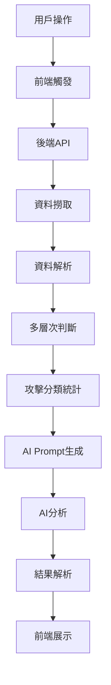

# F5 AI 分析完整流程圖

**文件版本**: v1.0  
**建立日期**: 2025-11-19  
**產品**: F5 Advanced WAF  
**分析模型**: 多層次判斷模型

---

## 📊 流程總覽



---

## 🎯 階段一：前端觸發階段

### 1.1 用戶操作流程

```
用戶進入頁面
  ↓
選擇時間範圍 (1h, 6h, 12h, 24h, 7d, 30d)
  或
選擇自定義日期範圍 (開始日期 → 結束日期)
  ↓
點擊「開始 AI 分析」按鈕
```

### 1.2 前端請求

**檔案位置**: `frontend/app/ai-analysis/f5/page.tsx`

**API 端點**: 
```
POST http://localhost:8080/api/f5/analyze-waf-risks
```

**請求參數**:
```json
{
  "aiProvider": "ollama",          // 或 "gemini"
  "model": "gemma3:4b",            // Ollama 模型
  "timeRange": "24h",              // 時間範圍
  "apiKey": "YOUR_API_KEY"         // Gemini 用 (Ollama 不需要)
}
```

**狀態管理**:
- `isLoading`: true → 顯示載入動畫
- `error`: null → 清空錯誤訊息
- `wafRisks`: [] → 清空舊資料

---

## 🔧 階段二：後端 API 處理

### 2.1 路由處理

**檔案位置**: `backend/routes/f5.routes.js`

**處理流程**:
```javascript
router.post('/analyze-waf-risks', async (req, res) => {
  // 1. 接收參數
  const { apiKey, model, timeRange, aiProvider } = req.body;
  
  // 2. 驗證參數
  if (aiProvider === 'gemini' && !apiKey) {
    return res.status(400).json({ error: '請設定 API Key' });
  }
  
  // 3. 建立服務實例
  const wafService = new F5WAFRiskService();
  
  // 4. 執行分析
  const analysisData = await wafService.analyzeF5WAF(timeRange);
  
  // 5. 生成 AI Prompt
  const aiPrompt = wafService.generateAIPrompt(analysisData);
  
  // 6. 呼叫 AI
  // 7. 解析回應
  // 8. 返回結果
});
```

---

## 📥 階段三：資料撈取階段

### 3.1 ELK MCP Client 連接

**檔案位置**: `backend/services/elkMCPClient.js`

**連接流程**:
```
檢查連接狀態
  ↓
ensureConnection() → 確保 MCP 連接可用
  ↓
建立 MCP Client
  ↓
連接到 Elasticsearch MCP Server
```

### 3.2 查詢建構

**索引名稱**: `across-f5-awaf-*`

**查詢結構**:
```json
{
  "query": {
    "range": {
      "@timestamp": {
        "gte": "2025-11-18T00:00:00Z",
        "lte": "2025-11-19T00:00:00Z"
      }
    }
  },
  "sort": [
    { "@timestamp": { "order": "desc" } }
  ],
  "size": 1000
}
```

**時間範圍處理**:
```javascript
parseTimeRange(timeRange) {
  // "1h" → 1小時 = 60 * 60 * 1000 ms
  // "6h" → 6小時 = 6 * 60 * 60 * 1000 ms
  // "24h" → 24小時 = 24 * 60 * 60 * 1000 ms
  // "7d" → 7天 = 7 * 24 * 60 * 60 * 1000 ms
  // "30d" → 30天 = 30 * 24 * 60 * 60 * 1000 ms
}
```

### 3.3 查詢執行

**MCP 工具調用**:
```javascript
await elkMCPClient.queryElasticsearch(timeRange, {
  indexPattern: 'across-f5-awaf-*'
});
```

**回傳資料格式**:
```javascript
{
  total: 1234,           // 總筆數
  hits: [                // 日誌陣列
    {
      id: "log_id",
      source: { ... },   // 原始日誌資料
      timestamp: "2025-11-19T10:00:00Z"
    },
    // ... 更多日誌
  ]
}
```

---

## 🔍 階段四：資料解析階段

### 4.1 欄位映射

**檔案位置**: `backend/config/products/f5/f5FieldMapping.js`

**映射範例**:
```javascript
F5_FIELD_MAPPING = {
  client_ip: {
    elk_field: "ip_client",
    display_name: "客戶端 IP",
    type: "ip"
  },
  attack_type: {
    elk_field: "attack_type",
    display_name: "攻擊類型",
    type: "keyword"
  },
  // ... 更多欄位
}
```

### 4.2 日誌解析

**檔案位置**: `backend/services/products/f5WAFRiskService.js`

**解析函數**: `parseF5Log(rawLog)`

**處理流程**:
```javascript
parseF5Log(rawLog) {
  return {
    // 基本資訊
    clientIP: rawLog["ip_client"],
    clientPort: rawLog["port_client"],
    clientCountry: rawLog.geoip?.country_name || 'Unknown',
    uri: rawLog["uri"],
    method: rawLog["method"],
    
    // 安全相關
    attackType: rawLog["attack_type"],
    severity: rawLog["severity"],
    ThreatLevel: rawLog["x_forwarded_for_header_value"],
    violationRating: rawLog["violation_rating"],
    violations: rawLog["violations"],
    
    // 簽章資訊
    sigIds: rawLog["sig_ids"],
    sigNames: rawLog["sig_names"],
    
    // 時間資訊
    timestamp: rawLog["@timestamp"]
  };
}
```

**地理位置處理**:
```javascript
// 1. 優先從 geoip.country_name 取得
let country = rawLog.geoip?.country_name;

// 2. Fallback: geoip.country_code2
if (!country) country = rawLog.geoip?.country_code2;

// 3. Fallback: 其他欄位
if (!country) country = rawLog[geo_location_field];

// 4. 最終 fallback
if (!country) country = 'Unknown';
```

---

## 🧠 階段五：多層次判斷階段

### 5.1 判斷模型架構

**檔案位置**: `backend/config/products/f5/f5Standards.js`

**核心函數**: `isRealSecurityThreat(log)`

### 5.2 Level 1: 確定性指標 (最高優先級)

```javascript
// 1.1 請求已被阻擋 → 確定是攻擊
if (log.request_status === 'blocked') {
  return {
    isAttack: true,
    confidence: 'certain',
    reason: 'F5 已阻擋此請求',
    level: 1,
    severity: 'high'
  };
}

// 1.2 有攻擊簽章 ID → 確定是攻擊
if (log.sig_ids && log.sig_ids !== 'N/A') {
  return {
    isAttack: true,
    confidence: 'certain',
    reason: `觸發攻擊簽章: ${log.sig_names}`,
    level: 1,
    severity: 'high'
  };
}

// 1.3 威脅等級為 High → 確定是攻擊
if (log.ThreatLevel === 'high') {
  return {
    isAttack: true,
    confidence: 'certain',
    reason: 'F5 威脅等級評估為 High',
    level: 1,
    severity: 'high'
  };
}

// 1.4 嚴重違規類型 → 確定是攻擊
const criticalViolations = [
  'VIOL_ATTACK_SIGNATURE',
  'VIOL_THREAT_CAMPAIGN',
  'VIOL_MALICIOUS_IP',
  'VIOL_VIRUS'
];
if (hasCriticalViolation(log.violations)) {
  return {
    isAttack: true,
    confidence: 'certain',
    reason: '觸發嚴重違規',
    level: 1,
    severity: 'critical'
  };
}
```

### 5.3 Level 2: 綜合評分

```javascript
// 2.1 違規評分 >= 70 → 高風險攻擊
const violationRating = parseFloat(log.violation_rating);
if (violationRating >= 70) {
  return {
    isAttack: true,
    confidence: 'high',
    reason: `違規評分達到高風險閾值: ${violationRating}`,
    level: 2,
    severity: violationRating >= 90 ? 'critical' : 'high'
  };
}

// 2.2 違規評分 >= 50 → 中風險
if (violationRating >= 50) {
  return {
    isAttack: true,
    confidence: 'medium',
    reason: `違規評分達到中風險閾值: ${violationRating}`,
    level: 2,
    severity: 'medium'
  };
}
```

### 5.4 Level 3: 攻擊類型匹配

```javascript
// 3.1 明確的攻擊類型
const attackTypeMapping = {
  'SQL Injection': { severity: 'critical', category: 'INJECTION' },
  'XSS': { severity: 'high', category: 'INJECTION' },
  'Path Traversal': { severity: 'high', category: 'INFO_DISCLOSURE' },
  'Command Execution': { severity: 'critical', category: 'INJECTION' }
};

if (log.attack_type in attackTypeMapping) {
  return {
    isAttack: true,
    confidence: 'high',
    reason: `偵測到攻擊類型: ${log.attack_type}`,
    level: 3,
    severity: attackTypeMapping[log.attack_type].severity
  };
}
```

### 5.5 Level 4: 行為模式分析

```javascript
// 4.1 嚴重程度 + 違規組合
if (log.severity in ['Error', 'Alert', 'Critical'] && log.violations) {
  return {
    isAttack: true,
    confidence: 'medium',
    reason: '高嚴重程度 + 違規組合',
    level: 4,
    severity: 'medium'
  };
}

// 4.2 多個弱信號組合 (2個以上)
let weakSignals = 0;
if (violationRating >= 30) weakSignals++;
if (log.ThreatLevel === 'medium') weakSignals++;
if (log.violations) weakSignals++;
if (log.severity in ['Warning', 'Error']) weakSignals++;

if (weakSignals >= 2) {
  return {
    isAttack: true,
    confidence: 'low',
    reason: '多個弱信號組合',
    level: 4,
    severity: 'low'
  };
}
```

### 5.6 威脅分數計算

**函數**: `calculateThreatScore(log)`

**計算公式**:
```javascript
威脅分數 = 100 - (權重累計扣分)

權重分配:
- request_status: 35%
  • blocked: 扣 35 分
  • alerted: 扣 25 分
  • logged: 扣 10 分

- violation_rating: 25%
  • 根據評分比例扣分
  • 評分越高，扣分越多

- severity: 20%
  • Critical/Alert: 扣 20 分
  • Error: 扣 16 分
  • Warning: 扣 12 分

- ThreatLevel: 15%
  • Critical: 扣 15 分
  • High: 扣 12 分
  • Medium: 扣 9 分

- signature_match: 5%
  • 有簽章匹配: 扣 3-5 分
```

**分數分級**:
```
0-30   : 確定攻擊 (Critical)
31-50  : 高風險 (High)
51-70  : 中風險 (Medium)
71-85  : 低風險 (Low)
86-100 : 正常流量 (Info)
```

---

## 📊 階段六：攻擊分類統計階段

### 6.1 統計類別

**檔案位置**: `backend/services/products/f5WAFRiskService.js`

#### 1. SQL 注入分析

**函數**: `analyzeSQLInjectionEnhanced(logEntries, realAttacks)`

**統計指標**:
```javascript
{
  count: 25,                    // 總次數
  highRisk: 15,                 // 高風險次數
  topIPs: [                     // 前10名攻擊IP
    { ip: "1.2.3.4", count: 10 },
    { ip: "5.6.7.8", count: 8 }
  ],
  topTargets: [                 // 前10名目標URI
    { uri: "/admin.php", count: 15 },
    { uri: "/api/user", count: 10 }
  ],
  topCountries: [               // 前5名來源國家
    { country: "China", count: 12 },
    { country: "Russia", count: 8 }
  ],
  affectedAssets: 5,            // 受影響資產數量
  avgViolationRating: 85.5,     // 平均違規評分
  avgThreatScore: 25.3,         // 平均威脅分數
  topSignatures: [              // 前3名簽章
    { name: "SQL Injection - UNION", count: 8 }
  ]
}
```

**判斷邏輯**:
```javascript
// 從已判定的真實攻擊中篩選 SQL 注入
const sqliLogs = realAttacks.filter(result => {
  return (
    result.attackCategory?.type?.includes('SQL') ||
    result.violationCategory?.violation?.includes('SQL')
  );
});
```

#### 2. XSS 攻擊分析

**函數**: `analyzeXSSAttacksEnhanced(logEntries, realAttacks)`

**統計結構**: 同 SQL 注入

**判斷關鍵字**:
- attack_type: "Cross Site Scripting (XSS)"
- violations: "VIOL_XSS"
- uri 包含: `<script>`, `onerror=`, `onload=`

#### 3. 命令執行分析

**函數**: `analyzeCommandExecutionEnhanced(logEntries, realAttacks)`

**判斷關鍵字**:
- attack_type: "Command Execution", "Remote Command Execution"
- violations: "VIOL_COMMAND_EXECUTION"
- uri 包含: `exec`, `shell`, `cmd`, `bash`

#### 4. 路徑遍歷分析

**函數**: `analyzePathTraversalEnhanced(logEntries, realAttacks)`

**判斷關鍵字**:
- attack_type: "Path Traversal", "Directory Traversal"
- violations: "VIOL_URL"
- uri 包含: `../`, `..\\`, `.git`, `.env`

#### 5. Bot 流量分析

**函數**: `analyzeBotTrafficEnhanced(logEntries, realAttacks)`

**判斷關鍵字**:
- attack_type: "Vulnerability Scan"
- violations: "VIOL_BOT_CLIENT", "VIOL_BROWSER"
- user_agent 包含: `bot`, `crawler`, `scanner`

#### 6. 資訊洩漏分析

**函數**: `analyzeInformationLeakageEnhanced(logEntries, realAttacks)`

**判斷關鍵字**:
- attack_type: "Information Leakage", "Predictable Resource Location"
- violations: "VIOL_DATA_GUARD", "VIOL_FILETYPE"
- uri 包含: `.git`, `.env`, `backup`, `config`

#### 7. 會話攻擊分析

**函數**: `analyzeSessionAttacksEnhanced(logEntries, realAttacks)`

**判斷關鍵字**:
- attack_type: "Session Hijacking", "CSRF", "Brute Force"
- violations: "VIOL_ASM_COOKIE_HIJACKING", "VIOL_CSRF", "VIOL_BRUTE_FORCE"

#### 8. 其他攻擊分析

**函數**: `analyzeOtherAttacksEnhanced(logEntries, realAttacks)`

**包含**: 所有不屬於上述分類的真實攻擊

### 6.2 地理分佈分析

**函數**: `analyzeGeoDistribution(logEntries)`

```javascript
{
  topCountries: [
    { country: "China", count: 120, percentage: 35.5 },
    { country: "Russia", count: 80, percentage: 23.7 },
    { country: "USA", count: 50, percentage: 14.8 }
  ],
  totalCountries: 25,
  unknownCount: 5
}
```

### 6.3 受影響資產分析

**函數**: `analyzeAffectedAssets(logEntries)`

```javascript
{
  totalAssets: 8,
  assetList: [
    { host: "api.example.com", attackCount: 45 },
    { host: "www.example.com", attackCount: 30 },
    { host: "admin.example.com", attackCount: 25 }
  ]
}
```

---

## 🤖 階段七：AI Prompt 生成階段

### 7.1 Prompt 結構

**檔案位置**: `backend/prompts/f5-waf-analysis-prompt.md`

**函數**: `wafService.generateAIPrompt(analysisData)`

**Prompt 組成**:

```markdown
# F5 Advanced WAF 安全分析任務

## 分析資料摘要

### 基本統計
- 總事件數: 1,234
- 真實攻擊數: 156
- 分析時間範圍: 2025-11-18 00:00 至 2025-11-19 00:00

### 攻擊類型分佈
1. SQL 注入: 25 次 (高風險: 15)
2. XSS 攻擊: 18 次 (高風險: 10)
3. 命令執行: 5 次 (高風險: 5)
4. 路徑遍歷: 12 次 (高風險: 8)
5. Bot 流量: 30 次 (高風險: 5)
6. 資訊洩漏: 15 次 (高風險: 10)
7. 會話攻擊: 8 次 (高風險: 6)
8. 其他攻擊: 43 次 (高風險: 20)

### 地理分佈
- 前5名來源國家: 中國(120), 俄羅斯(80), 美國(50), 德國(35), 法國(28)
- 總來源國家數: 25

### 受影響資產
- 總資產數: 8
- 主要目標: api.example.com (45次), www.example.com (30次)

## 詳細攻擊資訊

### SQL 注入
- 總次數: 25
- 高風險: 15
- 前3名攻擊IP:
  1. 1.2.3.4 (10次) - 中國
  2. 5.6.7.8 (8次) - 俄羅斯
  3. 9.10.11.12 (5次) - 美國
- 前3名目標URI:
  1. /admin.php (15次)
  2. /api/user (10次)
  3. /login (5次)
- 平均威脅分數: 25.3 (確定攻擊)
- 平均違規評分: 85.5 (高風險)

[... 其他攻擊類型的詳細資訊 ...]

## 任務要求

請根據以上資料，生成結構化的安全風險評估報告。

### 輸出格式 (JSON)
```json
{
  "risks": [
    {
      "id": "1",
      "title": "風險標題",
      "severity": "high",
      "category": "SQL Injection",
      "description": "風險描述",
      "impact": "影響說明",
      "affectedAssets": ["資產1", "資產2"],
      "attackCount": 25,
      "topSources": [
        { "ip": "1.2.3.4", "country": "中國", "count": 10 }
      ],
      "recommendation": {
        "title": "建議標題",
        "priority": "high",
        "actions": ["行動1", "行動2"],
        "estimatedTime": "30 分鐘"
      }
    }
  ]
}
```

請產生完整的 JSON 分析報告。
```

### 7.2 Prompt 特點

1. **結構化資料**: 清晰的統計數字
2. **多維度分析**: 攻擊類型、地理、資產
3. **詳細指標**: 威脅分數、違規評分
4. **明確格式**: JSON Schema 定義
5. **實例引導**: 提供範例格式

---

## 🧠 階段八：AI 分析階段

### 8.1 AI 提供者選擇

#### 選項 1: Ollama (本地)

**配置**:
```javascript
const ollamaUrl = 'http://localhost:11434';
const model = 'gemma3:4b';
```

**API 調用**:
```javascript
const response = await fetch(`${ollamaUrl}/api/generate`, {
  method: 'POST',
  headers: { 'Content-Type': 'application/json' },
  body: JSON.stringify({
    model: model,
    prompt: aiPrompt,
    stream: false,
    options: {
      temperature: 0.7,
      num_predict: 8192,
      num_ctx: 8192
    }
  })
});

const data = await response.json();
const responseText = data.response;
```

**優點**:
- 完全本地運行
- 無需 API Key
- 無使用費用
- 資料隱私

**缺點**:
- 需要本地資源
- 回應速度較慢
- 模型能力有限

#### 選項 2: Google Gemini (雲端)

**配置**:
```javascript
const genAI = new GoogleGenerativeAI(apiKey);
const model = 'gemini-2.0-flash-exp';
```

**API 調用**:
```javascript
const geminiModel = genAI.getGenerativeModel({ model });
const result = await geminiModel.generateContent(aiPrompt);
const responseText = result.response.text();
```

**優點**:
- 強大的分析能力
- 回應速度快
- 支援大量 token
- 高品質輸出

**缺點**:
- 需要 API Key
- 有使用費用
- 資料傳到雲端

### 8.2 AI 分析過程

```
1. 接收結構化 Prompt
   ↓
2. 理解統計資料
   ↓
3. 識別安全風險
   ↓
4. 評估風險嚴重程度
   ↓
5. 分析攻擊模式
   ↓
6. 生成執行建議
   ↓
7. 產生 JSON 格式報告
```

### 8.3 超時與錯誤處理

**超時設定**:
```javascript
const controller = new AbortController();
const timeoutId = setTimeout(() => {
  controller.abort();
}, 300000); // 5 分鐘

const response = await fetch(url, {
  signal: controller.signal
});
```

**錯誤處理流程**:
```
AI 調用失敗
  ↓
檢查錯誤類型
  ├─ 超時 → 使用 Fallback 資料
  ├─ 網路錯誤 → 重試一次
  ├─ API 錯誤 → 使用 Fallback 資料
  └─ 解析失敗 → 使用 Fallback 資料
```

---

## 📝 階段九：結果解析階段

### 9.1 JSON 解析

**函數**: `parseAIResponse(responseText)`

**解析流程**:
```javascript
// 1. 嘗試直接解析
try {
  aiAnalysis = JSON.parse(responseText);
  console.log('✅ 成功解析 JSON');
} catch (e) {
  // 2. 嘗試從 markdown 提取
  const jsonMatch = responseText.match(/```json\s*([\s\S]*?)\s*```/);
  if (jsonMatch) {
    aiAnalysis = JSON.parse(jsonMatch[1]);
  } else {
    // 3. 使用 Fallback
    aiAnalysis = generateFallbackRisks(analysisData);
  }
}
```

### 9.2 資料驗證

**驗證項目**:
```javascript
// 必須包含 risks 陣列
if (!aiAnalysis.risks || !Array.isArray(aiAnalysis.risks)) {
  throw new Error('Invalid response format');
}

// 每個 risk 必須包含必要欄位
aiAnalysis.risks.forEach(risk => {
  if (!risk.id || !risk.title || !risk.severity) {
    console.warn('Risk missing required fields:', risk);
  }
});
```

### 9.3 Fallback 機制

**函數**: `generateFallbackRisks(analysisData)`

**生成規則**:
```javascript
// 根據統計資料生成基本風險
const risks = [];

if (analysisData.sqlInjection.count > 0) {
  risks.push({
    id: generateId(),
    title: "SQL 注入攻擊偵測",
    severity: analysisData.sqlInjection.highRisk > 10 ? "high" : "medium",
    category: "SQL Injection",
    description: `偵測到 ${analysisData.sqlInjection.count} 次 SQL 注入攻擊`,
    attackCount: analysisData.sqlInjection.count,
    recommendation: {
      title: "強化 SQL 注入防護",
      priority: "high",
      actions: [
        "啟用參數化查詢",
        "更新 WAF 規則",
        "阻擋惡意 IP"
      ]
    }
  });
}

// ... 其他攻擊類型
```

---

## 🎨 階段十：前端展示階段

### 10.1 資料接收

**檔案位置**: `frontend/app/ai-analysis/f5/page.tsx`

**狀態更新**:
```javascript
// API 回應
const response = await fetch('/api/f5/analyze-waf-risks', {
  method: 'POST',
  body: JSON.stringify(requestData)
});

const data = await response.json();

// 更新狀態
setWafRisks(data.risks);
setAnalysisMetadata({
  totalEvents: data.metadata.totalEvents,
  timeRange: data.metadata.timeRange,
  analysisTimestamp: data.metadata.analysisTimestamp
});
setIsLoading(false);
setHasAttemptedLoad(true);
```

### 10.2 風險分類

**三欄佈局**:
```
┌──────────────┬──────────────┬──────────────┐
│   高風險     │   中風險     │   低風險     │
│  (Critical/  │   (Medium)   │    (Low)     │
│    High)     │              │              │
├──────────────┼──────────────┼──────────────┤
│ • 風險卡片1  │ • 風險卡片1  │ • 風險卡片1  │
│ • 風險卡片2  │ • 風險卡片2  │ • 風險卡片2  │
│ • ...        │ • ...        │ • ...        │
└──────────────┴──────────────┴──────────────┘
```

**分類邏輯**:
```javascript
const highRisks = wafRisks.filter(risk => 
  risk.severity === 'critical' || risk.severity === 'high'
);

const mediumRisks = wafRisks.filter(risk => 
  risk.severity === 'medium'
);

const lowRisks = wafRisks.filter(risk => 
  risk.severity === 'low'
);
```

### 10.3 風險卡片展示

**卡片結構**:
```jsx
<Card className="risk-card">
  {/* Header */}
  <CardHeader>
    <div className="flex items-center gap-2">
      <Badge severity={risk.severity}>
        {risk.severity}
      </Badge>
      <span className="category">{risk.category}</span>
    </div>
    <h3>{risk.title}</h3>
  </CardHeader>
  
  {/* Content */}
  <CardContent>
    {/* 描述 */}
    <p>{risk.description}</p>
    
    {/* 統計 */}
    <div className="stats">
      <span>攻擊次數: {risk.attackCount}</span>
      <span>受影響資產: {risk.affectedAssets?.length || 0}</span>
    </div>
    
    {/* 前3名攻擊來源 */}
    <div className="top-sources">
      {risk.topSources?.slice(0, 3).map(source => (
        <div key={source.ip}>
          <span>{source.ip}</span>
          <span>{source.country}</span>
          <span>{source.count} 次</span>
        </div>
      ))}
    </div>
    
    {/* 執行建議 */}
    <div className="recommendation">
      <h4>{risk.recommendation.title}</h4>
      <Button onClick={() => showOperationGuide(risk)}>
        查看執行操作
      </Button>
    </div>
  </CardContent>
</Card>
```

### 10.4 趨勢分析展示

**時間軸圖表**:
```
攻擊次數
  │
50├─────┐
  │     │
40├─    │  ┌──
  │  │  │  │
30├─ │  └──┘
  │  │
20├─ └──────
  │
10├────────────
  │
 0└─────────────────> 時間
   00:00  06:00  12:00  18:00
```

### 10.5 操作指引對話框

**觸發**: 點擊「查看執行操作」按鈕

**內容**:
```jsx
<Dialog open={showGuide}>
  <DialogHeader>
    <h2>{guide.title}</h2>
    <Badge>{guide.difficulty}</Badge>
    <span>預估時間: {guide.estimatedTime}</span>
  </DialogHeader>
  
  <DialogContent>
    {/* 步驟列表 */}
    {guide.steps.map((step, index) => (
      <div key={index} className="step">
        <div className="step-number">{index + 1}</div>
        <div className="step-content">
          <h3>{step.title}</h3>
          <p>{step.description}</p>
          {step.command && (
            <pre><code>{step.command}</code></pre>
          )}
          {step.warning && (
            <Alert variant="warning">{step.warning}</Alert>
          )}
        </div>
      </div>
    ))}
    
    {/* 執行確認 */}
    <Button onClick={handleExecute}>
      確認執行
    </Button>
  </DialogContent>
</Dialog>
```

### 10.6 執行記錄

**記錄內容**:
```javascript
{
  id: "record_123",
  timestamp: "2025-11-19T10:30:00Z",
  riskId: "risk_1",
  riskTitle: "SQL 注入攻擊偵測",
  actionTitle: "強化 SQL 注入防護",
  status: "completed",
  executedBy: "admin",
  notes: "已更新 WAF 規則並阻擋惡意 IP"
}
```

**儲存位置**: `localStorage` → `f5_action_records`

---

## 📋 完整資料流追蹤

### 範例：SQL 注入攻擊的完整追蹤

#### 1. ELK 原始日誌
```json
{
  "@timestamp": "2025-11-19T10:15:30Z",
  "ip_client": "1.2.3.4",
  "port_client": 45678,
  "uri": "/admin.php?id=1' UNION SELECT * FROM users--",
  "method": "GET",
  "attack_type": "SQL Injection",
  "severity": "Alert",
  "violation_rating": "90",
  "violations": "VIOL_ATTACK_SIGNATURE,VIOL_SQL_INJECTION",
  "sig_ids": "200000001",
  "sig_names": "SQL Injection - UNION Attack",
  "request_status": "blocked",
  "response_code": 403,
  "geoip": {
    "country_name": "China",
    "city_name": "Beijing"
  }
}
```

#### 2. 解析後的日誌物件
```javascript
{
  clientIP: "1.2.3.4",
  clientCountry: "China",
  uri: "/admin.php?id=1' UNION SELECT * FROM users--",
  method: "GET",
  attackType: "SQL Injection",
  severity: "Alert",
  violationRating: "90",
  violations: "VIOL_ATTACK_SIGNATURE,VIOL_SQL_INJECTION",
  sigIds: "200000001",
  sigNames: "SQL Injection - UNION Attack",
  request_status: "blocked",
  timestamp: "2025-11-19T10:15:30Z"
}
```

#### 3. 多層次判斷結果
```javascript
{
  isAttack: true,
  confidence: 'certain',
  reason: 'F5 已阻擋此請求（request_status: blocked）',
  level: 1,
  severity: 'high',
  threatScore: 15,
  scoreClassification: {
    label: 'attack',
    displayName: '確定攻擊',
    severity: 'critical'
  },
  attackCategory: {
    type: 'SQL Injection',
    category: 'INJECTION_ATTACKS',
    severity: 'critical'
  }
}
```

#### 4. 統計分析結果
```javascript
{
  sqlInjection: {
    count: 25,
    highRisk: 15,
    topIPs: [
      { ip: "1.2.3.4", count: 10, country: "China" }
    ],
    topTargets: [
      { uri: "/admin.php", count: 15 }
    ],
    avgThreatScore: 18.5,
    avgViolationRating: 87.2
  }
}
```

#### 5. AI 生成的風險
```javascript
{
  id: "risk_sql_001",
  title: "SQL 注入攻擊偵測",
  severity: "high",
  category: "SQL Injection",
  description: "偵測到 25 次 SQL 注入攻擊嘗試，其中 15 次為高風險攻擊。主要攻擊目標為管理後台頁面。",
  impact: "可能導致資料庫洩漏、資料篡改或系統入侵。",
  affectedAssets: ["admin.example.com", "api.example.com"],
  attackCount: 25,
  topSources: [
    { ip: "1.2.3.4", country: "中國", count: 10 }
  ],
  recommendation: {
    title: "強化 SQL 注入防護",
    priority: "high",
    actions: [
      "檢查並更新 F5 WAF SQL 注入簽章",
      "啟用參數化查詢保護",
      "封鎖重複攻擊的 IP 地址"
    ],
    estimatedTime: "30 分鐘"
  }
}
```

#### 6. 前端展示
```
┌─────────────────────────────────┐
│ 🔴 高風險 - SQL Injection       │
├─────────────────────────────────┤
│ SQL 注入攻擊偵測                │
│                                 │
│ 偵測到 25 次 SQL 注入攻擊...    │
│                                 │
│ 📊 統計資訊                     │
│ • 攻擊次數: 25                  │
│ • 高風險: 15                    │
│ • 受影響資產: 2                 │
│                                 │
│ 🌍 前3名攻擊來源                │
│ 1. 1.2.3.4 (中國) - 10次       │
│ 2. 5.6.7.8 (俄羅斯) - 8次      │
│ 3. 9.10.11.12 (美國) - 5次     │
│                                 │
│ 💡 建議                         │
│ 強化 SQL 注入防護               │
│ [查看執行操作]                  │
└─────────────────────────────────┘
```

---

## 🔧 技術架構總結

### 核心技術棧

**後端**:
- Node.js + Express.js
- MCP (Model Context Protocol)
- Elasticsearch
- Google Gemini AI / Ollama

**前端**:
- Next.js 14 (App Router)
- TypeScript
- React + Framer Motion
- Tailwind CSS
- shadcn/ui

### 關鍵配置文件

| 文件 | 功能 | 位置 |
|------|------|------|
| `f5Standards.js` | 多層次判斷模型 | `backend/config/products/f5/` |
| `f5FieldMapping.js` | ELK 欄位映射 | `backend/config/products/f5/` |
| `f5ELKConfig.js` | ELK 連接配置 | `backend/config/products/f5/` |
| `f5OperationGuides.js` | 操作指引庫 | `backend/config/products/f5/` |
| `f5WAFRiskService.js` | 風險分析服務 | `backend/services/products/` |
| `elkMCPClient.js` | ELK MCP 客戶端 | `backend/services/` |
| `f5.routes.js` | API 路由 | `backend/routes/` |
| `page.tsx` | F5 分析頁面 | `frontend/app/ai-analysis/f5/` |

### 資料流向圖

```
┌─────────────────────────────────────────────────────────────┐
│                        前端 (Next.js)                        │
│  ┌─────────┐    ┌──────────┐    ┌───────────────────────┐  │
│  │ 用戶操作 │ → │ API 請求 │ → │ 狀態管理 & 結果展示 │  │
│  └─────────┘    └──────────┘    └───────────────────────┘  │
└──────────────────────────┬──────────────────────────────────┘
                           │ HTTP POST
                           ↓
┌─────────────────────────────────────────────────────────────┐
│                     後端 (Express.js)                        │
│  ┌──────────┐    ┌────────────────┐    ┌──────────────┐    │
│  │ API 路由 │ → │ WAF Risk Service│ → │ AI Provider  │    │
│  └──────────┘    └────────────────┘    └──────────────┘    │
└──────────────────────────┬──────────────────────────────────┘
                           │ MCP Protocol
                           ↓
┌─────────────────────────────────────────────────────────────┐
│                    ELK MCP Server                            │
│  ┌──────────────┐    ┌──────────────────────────────────┐  │
│  │ MCP Client   │ → │ Elasticsearch Query Engine        │  │
│  └──────────────┘    └──────────────────────────────────┘  │
└──────────────────────────┬──────────────────────────────────┘
                           │ Query DSL
                           ↓
┌─────────────────────────────────────────────────────────────┐
│                    Elasticsearch                             │
│  ┌──────────────────────────────────────────────────────┐  │
│  │ Index: across-f5-awaf-*                               │  │
│  │ • F5 WAF 原始日誌                                     │  │
│  │ • 攻擊簽章、違規資訊                                  │  │
│  │ • 地理位置、時間戳記                                  │  │
│  └──────────────────────────────────────────────────────┘  │
└─────────────────────────────────────────────────────────────┘
```

---

## 📈 效能指標

### 分析速度

| 階段 | 預估時間 | 備註 |
|------|----------|------|
| 資料撈取 | 2-5 秒 | 取決於日誌量 |
| 資料解析 | 1-2 秒 | 本地處理 |
| 多層次判斷 | 2-3 秒 | 本地處理 |
| 統計分析 | 1-2 秒 | 本地處理 |
| AI 分析 (Gemini) | 5-10 秒 | 網路延遲 |
| AI 分析 (Ollama) | 30-60 秒 | 本地運算 |
| 結果解析 | < 1 秒 | 本地處理 |
| **總計 (Gemini)** | **15-25 秒** | |
| **總計 (Ollama)** | **40-75 秒** | |

### 資料規模

| 項目 | 數量 | 備註 |
|------|------|------|
| 查詢日誌上限 | 1,000 筆 | 可調整 |
| 違規類型 | 80+ 種 | F5 官方定義 |
| 攻擊類型 | 20+ 種 | 常見攻擊 |
| 攻擊簽章庫 | 可擴展 | 持續更新 |
| 操作指引 | 20+ 個 | 實務操作 |

---

## 🎯 分析準確度

### 多層次判斷模型優勢

1. **高準確度**: 四層判斷機制，降低誤報率
2. **可追溯性**: 每個判斷都有明確理由和層級
3. **可調整性**: 各層閾值可根據實際情況調整
4. **全面性**: 涵蓋 F5 所有安全指標

### 判斷信心度分級

| 信心度 | 判斷層級 | 準確度 | 說明 |
|--------|----------|--------|------|
| certain | Level 1 | 95%+ | 確定性指標（blocked, 簽章） |
| high | Level 2-3 | 85-95% | 高評分或明確攻擊類型 |
| medium | Level 4 | 70-85% | 行為模式組合 |
| low | Level 4 | 60-70% | 弱信號組合 |

---

## 🔒 安全考量

### 資料隱私

**Ollama 模式**:
- ✅ 完全本地處理
- ✅ 資料不離開內網
- ✅ 適合敏感環境

**Gemini 模式**:
- ⚠️ 資料傳送到 Google
- ⚠️ 需評估隱私風險
- ✅ 可脫敏處理後傳送

### 存取控制

- 後端 API 需身份驗證
- 前端需登入才能存取
- 操作記錄留存審計

---

## 🚀 未來優化方向

### 1. 即時分析
- WebSocket 推送即時威脅
- 自動觸發高風險告警

### 2. 機器學習
- 訓練自定義攻擊模型
- 行為基線學習

### 3. 自動化回應
- 自動封鎖惡意 IP
- 自動更新 WAF 規則

### 4. 報告生成
- PDF 報告匯出
- 定期報告排程

### 5. 多產品整合
- Cloudflare + F5 統一分析
- 跨產品威脅關聯

---

## 📞 問題排查

### 常見問題

#### 1. 查不到日誌資料
```
檢查項目:
- ELK 索引是否正確: across-f5-awaf-*
- 時間範圍是否有資料
- MCP Server 是否正常運行
- 網路連接是否正常
```

#### 2. AI 分析超時
```
解決方案:
- 增加超時時間（目前 5 分鐘）
- 減少日誌查詢量
- 簡化 Prompt 內容
- 使用 Fallback 機制
```

#### 3. 國家資訊顯示 Unknown
```
原因:
- geoip 欄位未配置
- IP 地址為內網 IP
- Elasticsearch 未安裝 GeoIP plugin

解決:
- 安裝 GeoIP 外掛
- 配置 GeoIP 資料庫
- 更新 Elasticsearch pipeline
```

#### 4. 誤報率高
```
調整方案:
- 提高 violation_rating 閾值
- 調整多層次判斷權重
- 增加白名單過濾
- 優化簽章規則
```

---

## 📚 參考文件

### 官方文件
- [F5 BIG-IP ASM 官方文件](https://techdocs.f5.com/)
- [F5 Violation Types v17.1](backend/docs/f5/v17.1/violations-description.md)
- [Elasticsearch Query DSL](https://www.elastic.co/guide/en/elasticsearch/reference/current/query-dsl.html)

### 內部文件
- [F5 AI 分析實施報告](F5_AI_ANALYSIS_IMPLEMENTATION_REPORT.md)
- [F5 AI 手動分析計畫](F5_AI_MANUAL_ANALYSIS_FINAL_PLAN.md)
- [F5 操作指引補充](F5_CLOUDFLARE_MANUAL_ANALYSIS_IMPLEMENTATION_REPORT.md)

---

**文件結束**

如有任何問題或需要更詳細的說明，請參考相關文件或聯繫開發團隊。


